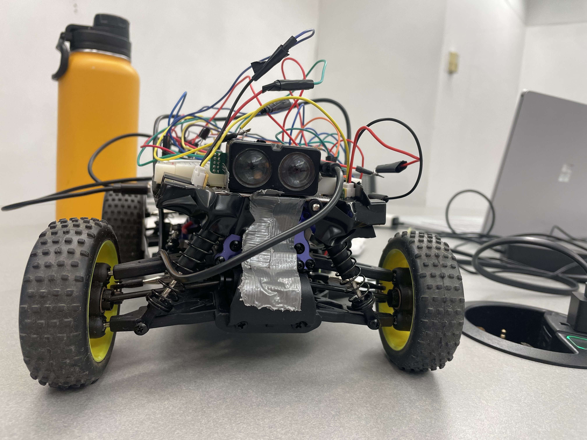
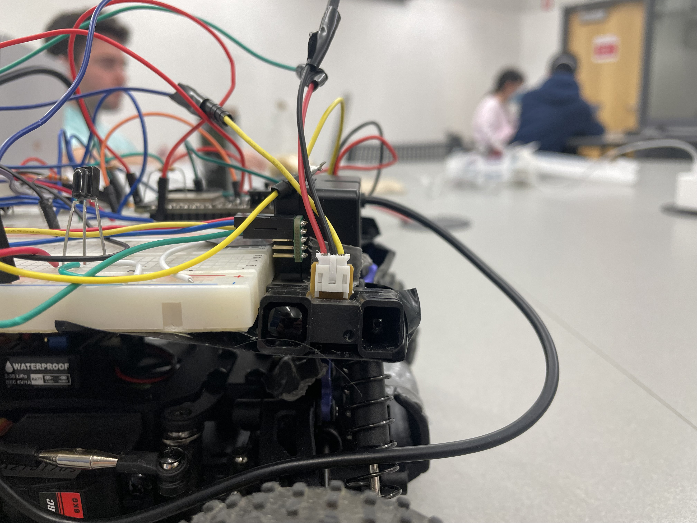
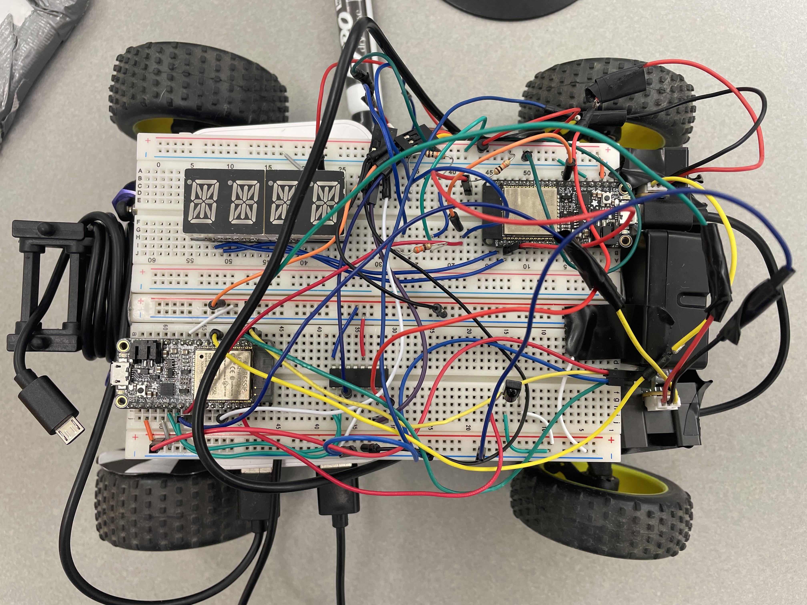

# Partial Autonomy - Follow a Wall & Emergency Stop
Authors: Andrew Heins Brownback, Mark Paul Vinciguerra, Timin Carlos Kanani

Date: 2022-04-22
-----

## Summary

In this project we implemented a partially-autonomous RC vehicle, which uses proportional, integral, differential (PID) algorithm to mantain speed and direction. By having a set speed as well as a set distance from a wall, we used various sensors to detect the current distance and calculate the error and adjust the car's speed or direction proportionally.

## Solution Design

In the design of our solution we used various peripheral components to the circuitry we had already implmented which control the two servo components of the car which control steering and motor speed. 
--> Speed sensing:
In order to measure the speed of our car we implemented a optical encoder and fixed a black and white pattern to the wheel. The optical encoder could then indicate a voltage pulse on a transition from black to white, and using the esspressif pulse counting library we could count the pulses. Then we were able convert the amount of pulses per second to a speed using the circumfrence of the wheel as well as the number of transitions from black to white on our pattern(6.)

--> Distance sensing:
To measure the distance in various directions, we incorporated three sensors. The first being the Garmin v4 Lidar, which was fixed to the front of the car and measures distance of object in front which allows the car to stop or speed up, given something might be in the way or not. We chose lidar for this sensor since it draws a lot of power and we only needed 1 on the front anyway. Also it is by far the most accurate. We needed to measure the distances on the left and right of the car in order to determine when steering was necessary. For this we used IR-rangefinders, since they are more accurate than ultrasonic and easy to incorporate through ADC pins. Also, their range (20-150cm) fit what we needed well. 

--> PID for Steering:
In order to adjust speed and steering proportionally to the error from the setpoint detected by our sensors, we used PID. This was especially important for the steering since it was not difficult to maintain a constant speed. Without PID for the steering, if the car became too close to the wall, it would steer away from the wall but then it would be too far away and steer back at the same intensity/angle. This led the car to drive in an S shape and with increasingly dramatic turns until it hit the wall. By implementing PID, we could simply adjust the steering based on the integral of the error measured in the past and therefore not steer too hard or very hard based on the previous cumulative error. 

--> PID for Stopping:
Lastly, we implemented PID in order to stop our car based on how far away it sensed an object. Meaning, if a wall was far away it would decelerate slowly as there was no need to dramatically come to a halt if the wall was far. Contrastingly, if an object suddenly appears very close to the car, it could apply the brakes and quickly stop. 

--> Remote Control:
In order to control our vehicle remotely, we used our IR reciever and contructed a remote similar to the one we made in the voting quest, which tells the car to stop or start driving. 

## Investigative Question

How would we adjust the solution if asked to implement "adaptive cruise control"?

In implmenting adaptive cruise control, we could need to maintain a speed based on a moving object in front of our vehicle, in a sense, following the vehicle in front of it. Given our current design this would not be too challenging, since we could simply implement the PID which maintains our speed, and make the set point a distance in front of the car instead of having the setpoint be a speed. By doing it this way, we could then have the controller adjust the speed based on the distance read from our lidar, and if the car in front of it slows down the distance would decrease. By measuring the change in distance over time we could determine the speed/change in speed, and so we could then take the derivative of this change in speed in order to determine how quickly to slow down our own bugatti. This would work similary for if the car in front were to speed up and we would just use the increase in distance over time to determine the change in speed instead.  

## Sketches and Photos

  

 

### Optical Encoder Setup

### Lidar 

### IR-Rangefinder

### All Wiring

## Supporting Artifacts
- [Link to video demo -->](https://drive.google.com/file/d/1Yudi7i-k1_aOkcJ0S72-hU6sTQ7btMnf/view?usp=sharing). Not to exceed 120s

- [Link to code -->](https://github.com/BU-EC444/Team11-Team-Hobbit-Brownback-Vinciguerra-Kanani/tree/master/quest-5/code).

## Modules, Tools, Source Used Including Attribution
We used the following links to help in our design.

## References

https://learn.sparkfun.com/tutorials/qrd1114-optical-detector-hookup-guide#example-circuit

https://docs.espressif.com/projects/esp-idf/en/latest/esp32/api-reference/peripherals/pcnt.html

https://docs.espressif.com/projects/esp-idf/en/latest/esp32/api-reference/peripherals/gptimer.html

https://github.com/BU-EC444/bu-ec444-whizzer/blob/Spring-2022/images/encoder.gif

https://github.com/BU-EC444/bu-ec444-whizzer/blob/Spring-2022/briefs/design-patterns/dp-pid.md

http://static.garmin.com/pumac/LIDAR-Lite%20LED%20v4%20Instructions_EN-US.pdf

https://github.com/garmin/LIDARLite_Arduino_Library

https://github.com/espressif/esp-idf/tree/master/examples/peripherals/i2c/i2c_simple

https://github.com/BU-EC444/bu-ec444-whizzer/blob/Spring-2022/briefs/design-patterns/dp-esc-buggy.md

https://www.hobbywing.com/products/enpdf/QuicRunWP1625-WP860-WP1060.pdf

https://p11.secure.hostingprod.com/@hobbypartz.com/ssl/ibuyrc/manual/51C852.pdf

-----

